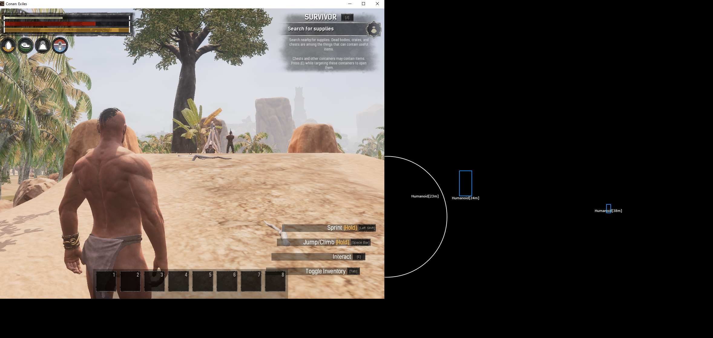
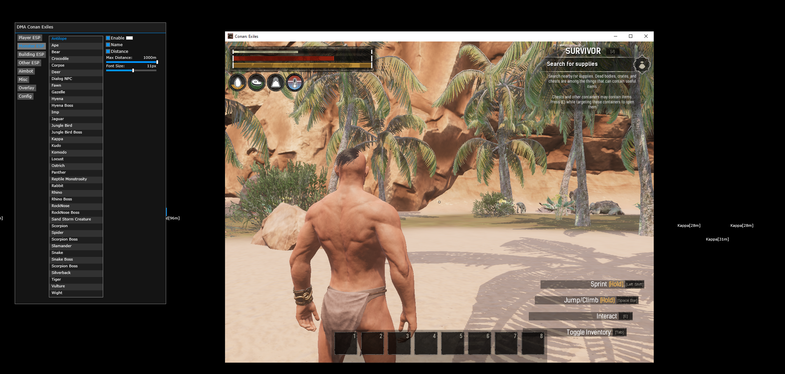
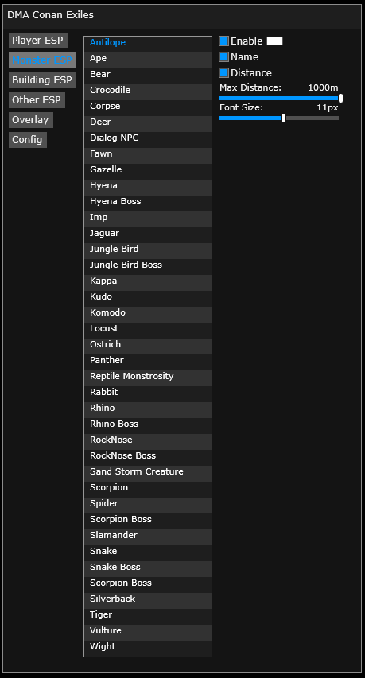

# Conan Exiles DMA
Player ESP, NPC ESP, Monster ESP, Aimbot, Speedhack

## Showcase

<a href="https://youtu.be/nLuHipZOcJY">

  

</a>

  

  

## Instructions
* [Installation Guide](./Instructions.md)
 

## Features
* Aimbot
  * Enable
  * Draw FOV
  * FOV
  * Priority
  * AimKey
* Player ESP
  * Name
  * Distance
  * Font Size
  * Max Distance
  * Box
* Monster ESP
  * Name
  * Distance
  * Font Size
  * Max Distance
* Building ESP
  * Name
  * Distance
  * Font Size
  * Max Distance
* Other ESP
  * Name
  * Distance
  * Font Size
  * Max Distance
* Overlay
  * Custom W2S Resolution
* Misc
  * Speedhack
  * Speed Amount
  * View Locked Contents
* Config
  * Load
  * Save

## Credits
* [PCILeech](https://github.com/ufrisk/pcileech)
* [MemProcFS](https://github.com/ufrisk/MemProcFS)
* [DMALibrary](https://github.com/Metick/DMALibrary/tree/Master)

